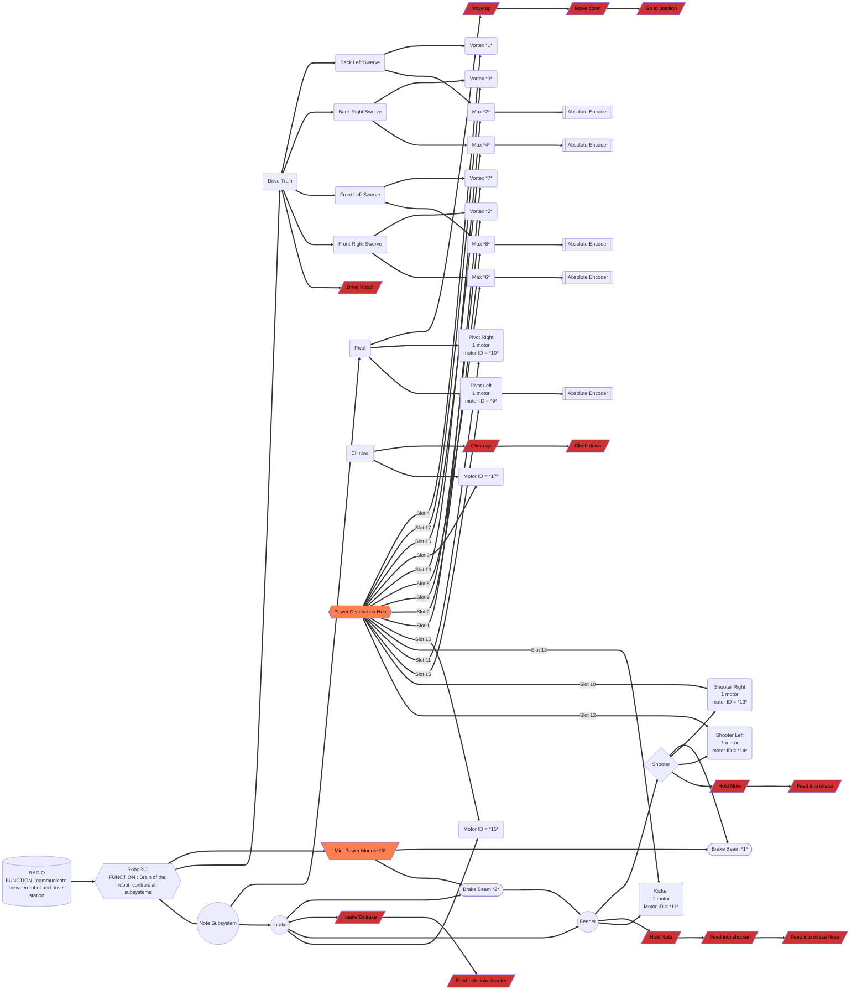

```mermaid
graph LR;
    PDH{{Power Distribution Hub}};
    
    subgraph ShooterGroup
        direction LR
        ShooterSystem{Shooter};
        ShooterSystem==>FUNCSHOOTER;
        ShooterSystem==>ShooterLeft(Shooter Left
1 motor
motor ID = *14*);
        PDH==>|Slot 12|ShooterLeft

        ShooterSystem==>ShooterRight(Shooter Right
1 motor
motor ID = *13*);
        PDH==>|Slot 10|ShooterRight
    end

    subgraph FeederGroup
        direction LR
        FeederSystem==>Feeder(Kicker
1 motor
Motor ID = *11*)
        FeederSystem ==>FUNCFEEDER;
        FUNCFEEDER[/Hold Note/] ==>FUNCFEEDER2;
        FUNCFEEDER2[/Feed into shooter/] ==> FUNCFEEDER3;
        FUNCFEEDER3[/Feed into intake Note/];
    end

    subgraph IntakeGroup
        direction LR
        RoboRIO==>NoteSubsystem((Note Subsystem))==>IntakeSystem((Intake));
        IntakeSystem==>IntakeMotor(Motor ID = *15*)
        IntakeSystem==>FeederSystem((Feeder))==>ShooterSystem;
        IntakeSystem==>FUNCINTAKE1;
        MiniPowerModule==>BrakeBeamNote
        IntakeSystem===>BrakeBeamNote([Brake Beam *2*])==>FeederSystem;
    end

    subgraph ClimberGroup
        direction LR
        ClimberSystem(Climber);
        ClimberSystem==>ClimberMotor(Motor ID = *17*);
        ClimberSystem==>FUNCCLIMBER1;
    end

    subgraph PivotGroup
        direction LR
        NoteSubsystem==>PivotSystem(Pivot);
        PivotSystem==>PivotLeft(Pivot Left
1 motor
motor ID = *9*);
        PDH==>|Slot 15|PivotLeft
        PivotSystem==>PivotRight(Pivot Right
1 motor
motor ID = *10*);
        PDH==>|Slot 11|PivotRight
    end

    subgraph DriveTrainGroup
        direction LR
        DriveTrain(Drive Train);
        DriveTrain==>FUNCDRIVE[/Drive Robot/];
        DriveTrain==>FrontRightSwerve(Front Right Swerve);
        DriveTrain==>FrontLeftSwerve(Front Left Swerve);
        DriveTrain==>BackRightSwerve(Back Right Swerve);
        DriveTrain==>BackLeftSwerve(Back Left Swerve);
    end

    subgraph SwerveGroup
        direction LR
        FrontRightSwerve==>MaxFR(Max *6*);
        FrontLeftSwerve==>MaxFL(Max *8*);
        BackRightSwerve==>MaxBR(Max *4*);
        BackLeftSwerve==>MaxBL(Max *2*);
        FrontRightSwerve==>VortexFR(Vortex *5*);
        FrontLeftSwerve==>VortexFL(Vortex *7*);
        BackRightSwerve==>VortexBR(Vortex *3*);
        BackLeftSwerve==>VortexBL(Vortex *1*);
    end

    subgraph EncoderGroup
        direction LR
        MaxFR==>EncoderFR[[Absolute Encoder]];
        MaxFL==>EncoderFL[[Absolute Encoder]];
        MaxBR==>EncoderBR[[Absolute Encoder]];
        MaxBL==>EncoderBL[[Absolute Encoder]];
        PivotLeft==>PivotEncoder[[Absolute Encoder]];
    end

    RADIO[(RADIO
FUNCTION : communicate between robot and drive station)]==>RoboRIO;
    RoboRIO{{RoboRIO
FUNCTION : Brain of the robot, controls all subsystems}}==>DriveTrain;
    RoboRIO==>MiniPowerModule[\Mini Power Module *3*/]==>ShooterBrakeBeam;
    ShooterSystem==>ShooterBrakeBeam([Brake Beam *1*]);
    
    FUNCINTAKE1[/Intake/Outtake/]==>FUNCINTAKE2;
    FUNCINTAKE2[/Feed note into shooter/];
    FUNCSHOOTER[/Hold Note/] ==>FUNCSHOOTER2;
    FUNCSHOOTER2[/Feed into intake/];

    FUNCCLIMBER1[/Climb up/]==>FUNCCLIMBER2
    FUNCCLIMBER2[/Climb down/]

    PivotSystem==>FUNCPIVOT1[/Move up/]==>FUNCPIVOT2;
    FUNCPIVOT2[/Move down/]==>FUNCPIVOT3;
    FUNCPIVOT3[/Go to position/];

    classDef fuctionStyle fill:#ce3131,stroke-width:2px,color:#000;
    class FUNCINTAKE1,FUNCINTAKE2,FUNCINTAKE3,FUNCBREAKBEAM,FUNCFEEDER,FUNCFEEDER2,FUNCFEEDER3,FUNCSHOOTER,FUNCSHOOTER2,FUNCSHOOTER3,FUNCDRIVE,FUNCPIVOT1,FUNCPIVOT2,FUNCPIVOT3,FUNCCLIMBER1,FUNCCLIMBER2 fuctionStyle;

    classDef invisible fill:none,stroke:none,color:transparent;
    class invisibleShooterGroup,IntakeGroup,FeederGroup,ShooterGroup,PivotGroup,DriveTrainGroup,EncoderGroup,SwerveGroup,ClimberGroup invisible;

    classDef powerStyle fill:#ff7f50,stroke-width:2px,color:#000;
    class PDH,MiniPowerModule powerStyle;

    linkStyle default interpolate basis;

    PDH==>|Slot 13|Feeder
    PDH==>|Slot 15|IntakeMotor
    PDH==>|Slot 1|VortexFL
    PDH==>|Slot 2|MaxFL
    PDH==>|Slot 9|VortexFR
    PDH==>|Slot 8|MaxFR
    PDH==>|Slot 19|MaxBL
    PDH==>|Slot 3|ClimberMotor
    PDH==>|Slot 16|MaxBR
    PDH==>|Slot 17|VortexBR
    PDH==>|Slot 4|VortexBL


```
