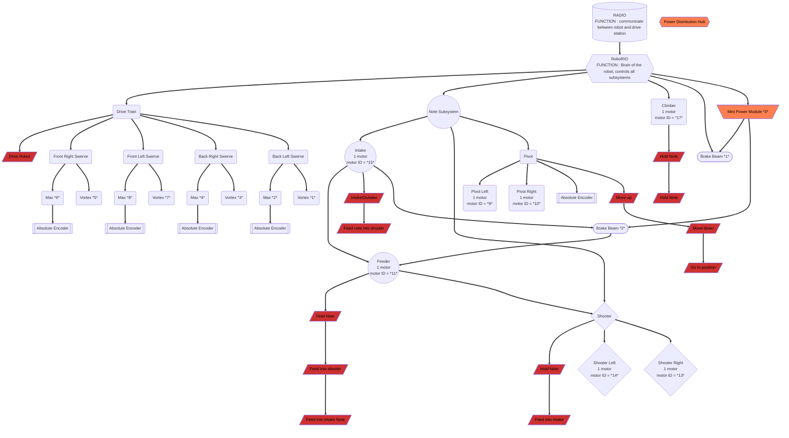

```mermaid

graph TD;
    subgraph invisibleShooterGroup
        direction LR
        ShooterSystem{Shooter};
        ShooterSystem==>FUNCSHOOTER;
        ShooterSystem==>ShooterLeft{Shooter Left
1 motor
motor ID = *14*};
        ShooterSystem==>ShooterRight{Shooter Right
1 motor
motor ID = *13*};
    end

subgraph invisibleFeederGroup
        direction LR
        FeederSystem ==>FUNCFEEDER;
        FUNCFEEDER[/Hold Note/] ==>FUNCFEEDER2;
        FUNCFEEDER2[/Feed into shooter/] ==> FUNCFEEDER3;
        FUNCFEEDER3[/Feed into intake Note/];
    end

    RoboRIO{{RoboRIO
FUNCTION : Brain of the robot, controls all subsystems}}==>DriveTrain;
    DriveTrain(Drive Train);
    DriveTrain==>FUNCDRIVE[/Drive Robot/];
    RoboRIO==>NoteSubsystem((Note Subsystem));
    NoteSubsystem==>IntakeSystem((Intake
1 motor
motor ID = *15*));
    NoteSubsystem==>ShooterSystem;
    RoboRIO==>ClimberSystem(Climber
1 motor
motor ID = *17*);
    ClimberSystem==>FUNCCLIMBER1
    IntakeSystem==>FeederSystem((Feeder
1 motor
motor ID = *11*))==>ShooterSystem;
    IntakeSystem==>FUNCINTAKE1;
    NoteSubsystem==>PivotSystem(Pivot);
    PivotSystem==>PivotLeft(Pivot Left
1 motor
motor ID = *9*);
    PivotSystem==>PivotRight(Pivot Right
1 motor
motor ID = *10*);
    DriveTrain==>FrontRightSwerve(Front Right Swerve);
    DriveTrain==>FrontLeftSwerve(Front Left Swerve);
    DriveTrain==>BackRightSwerve(Back Right Swerve);
    DriveTrain==>BackLeftSwerve(Back Left Swerve);
    FrontRightSwerve==>MaxFR(Max *6*);
    FrontLeftSwerve==>MaxFL(Max *8*);
    BackRightSwerve==>MaxBR(Max *4*);
    BackLeftSwerve==>MaxBL(Max *2*);
    FrontRightSwerve==>VortexFR(Vortex *5*);
    FrontLeftSwerve==>VortexFL(Vortex *7*);
    BackRightSwerve==>VortexBR(Vortex *3*);
    BackLeftSwerve==>VortexBL(Vortex *1*);
    MaxFR==>EncoderFR[[Absolute Encoder]];
    MaxFL==>EncoderFL[[Absolute Encoder]];
    MaxBR==>EncoderBR[[Absolute Encoder]];
    MaxBL==>EncoderBL[[Absolute Encoder]];
    PivotSystem==>PivotEncoder[[Absolute Encoder]];
    IntakeSystem===>BrakeBeamNote([Brake Beam *2*])==>FeederSystem;
    RoboRIO==>ShooterBrakeBeam([Brake Beam *1*]);
    RoboRIO==>MiniPowerModule[\Mini Power Module *3*/]==>ShooterBrakeBeam;
    MiniPowerModule==>BrakeBeamNote;
    RADIO[(RADIO
FUNCTION : communicate between robot and drive station)]==>RoboRIO;
    FUNCINTAKE1[/Intake/Outtake/]==>FUNCINTAKE2;
    FUNCINTAKE2[/Feed note into shooter/];
    FUNCSHOOTER[/Hold Note/] ==>FUNCSHOOTER2;
    FUNCSHOOTER2[/Feed into intake/];

    FUNCCLIMBER1[/Hold Note/]==>FUNCCLIMBER2
    FUNCCLIMBER2[/Hold Note/]

    PivotSystem==>FUNCPIVOT1[/Move up/]==>FUNCPIVOT2;
    FUNCPIVOT2[/Move down/]==>FUNCPIVOT3;
    FUNCPIVOT3[/Go to position/];

    PDH{{Power Distribution Hub}};


    classDef fuctionStyle fill:#ce3131,stroke-width:2px,color:#000;
    class FUNCINTAKE1,FUNCINTAKE2,FUNCINTAKE3,FUNCBREAKBEAM,FUNCFEEDER,FUNCFEEDER2,FUNCFEEDER3,FUNCSHOOTER,FUNCSHOOTER2,FUNCSHOOTER3,FUNCDRIVE,FUNCPIVOT1,FUNCPIVOT2,FUNCPIVOT3,FUNCCLIMBER1,FUNCCLIMBER2 fuctionStyle;

    classDef invisible fill:none,stroke:none,color:transparent;
    class invisibleShooterGroup,invisibleFeederGroup invisible;

    classDef powerStyle fill:#ff7f50,stroke-width:2px,color:#000;
    class PDH,MiniPowerModule powerStyle;

    linkStyle default interpolate basis;


```
