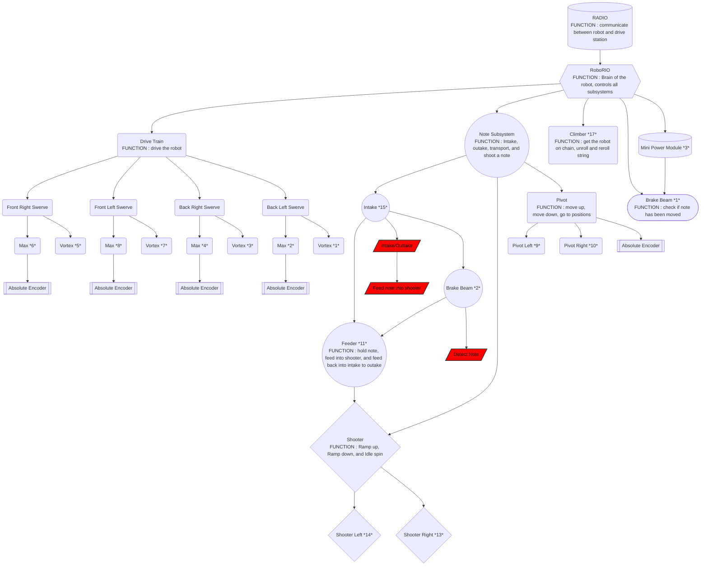

```mermaid
graph TD;
    RoboRIO{{RoboRIO
FUNCTION : Brain of the robot, controls all subsystems}}-->DriveTrain;
    DriveTrain(Drive Train
FUNCTION : drive the robot );
    RoboRIO-->NoteSubsystem((Note Subsystem
FUNCTION : Intake, outake, transport, and shoot a note));
    NoteSubsystem-->IntakeSystem((Intake *15*));
    NoteSubsystem-->ShooterSystem{Shooter
FUNCTION : Ramp up, Ramp down, and Idle spin};
    ShooterSystem-->ShooterLeft{Shooter Left *14*};
    ShooterSystem-->ShooterRight{Shooter Right *13*};
    RoboRIO-->ClimberSystem(Climber *17*
FUNCTION : get the robot on chain, unroll and reroll string);
    IntakeSystem-->FeederSystem((Feeder *11*
FUNCTION : hold note, feed into shooter, and feed back into intake to outake))-->ShooterSystem;
IntakeSystem-->FUNCINTAKE1;
    NoteSubsystem-->PivotSystem(Pivot
FUNCTION : move up, move down, go to positions);
    PivotSystem-->PivotLeft(Pivot Left *9*);
    PivotSystem-->PivotRight(Pivot Right *10*);
    DriveTrain-->FrontRightSwerve(Front Right Swerve);
    DriveTrain-->FrontLeftSwerve(Front Left Swerve);
    DriveTrain-->BackRightSwerve(Back Right Swerve);
    DriveTrain-->BackLeftSwerve(Back Left Swerve);
    FrontRightSwerve-->MaxFR(Max *6*);
    FrontLeftSwerve-->MaxFL(Max *8*);
    BackRightSwerve-->MaxBR(Max *4*);
    BackLeftSwerve-->MaxBL(Max *2*);
    FrontRightSwerve-->VortexFR(Vortex *5*);
    FrontLeftSwerve-->VortexFL(Vortex *7*);
    BackRightSwerve-->VortexBR(Vortex *3*);
    BackLeftSwerve-->VortexBL(Vortex *1*);
    MaxFR-->EncoderFR[[Absolute Encoder]];
    MaxFL-->EncoderFL[[Absolute Encoder]];
    MaxBR-->EncoderBR[[Absolute Encoder]];
    MaxBL-->EncoderBL[[Absolute Encoder]];
    PivotSystem-->PivotEncoder[[Absolute Encoder]];
    IntakeSystem--->BrakeBeamNote((Brake Beam *2*))-->FeederSystem;
    BrakeBeamNote-->FUNCBREAKBEAM;
    RoboRIO-->ShooterBrakeBeam([Brake Beam *1*
FUNCTION : check if note has been moved]);
    RoboRIO-->MiniPowerModule[(Mini Power Module *3*)]-->ShooterBrakeBeam;
    RADIO[(RADIO
FUNCTION : communicate between robot and drive station)]-->RoboRIO;
FUNCINTAKE1[/Intake/Outtake/]-->FUNCINTAKE2;
    FUNCINTAKE2[/Feed note into shooter/];
FUNCBREAKBEAM[/Detect Note/];

classDef fuctionStyle fill:#f00,stroke:#333,stroke-width:2px,color:#000;
    class FUNCINTAKE1,FUNCINTAKE2,FUNCINTAKE3,FUNCBREAKBEAM fuctionStyle;

```
