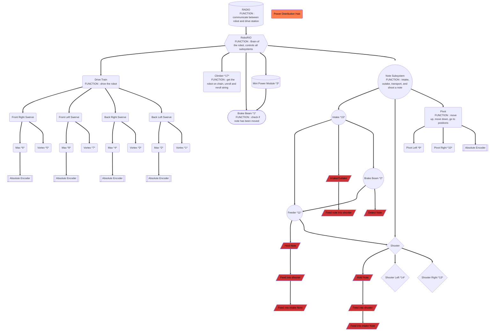

```mermaid

graph TD;

    %% Subgraph for Shooter System
    subgraph invisibleShooterGroup
        direction LR
        ShooterSystem{Shooter};
        ShooterSystem==>FUNCSHOOTER;
        ShooterSystem==>ShooterLeft{Shooter Left *14*};
        ShooterSystem==>ShooterRight{Shooter Right *13*};
    end

    %% Subgraph for Feeder System
    subgraph invisibleFeederGroup
        direction LR
        FeederSystem ==>FUNCFEEDER;
        FUNCFEEDER[/Hold Note/] ==>FUNCFEEDER2;
        FUNCFEEDER2[/Feed into shooter/] ==> FUNCFEEDER3;
        FUNCFEEDER3[/Feed into intake Note/];
    end

    %% Subgraph for Note Subsystem
    subgraph invisibleNoteSubsystemGroup
        direction LR
        NoteSubsystem((Note Subsystem
        FUNCTION : Intake, outake, transport, and shoot a note));
        NoteSubsystem==>IntakeSystem((Intake *15*));
        NoteSubsystem==>ShooterSystem;
        NoteSubsystem==>PivotSystem(Pivot
        FUNCTION : move up, move down, go to positions);
    end

    %% Subgraph for Intake System
    subgraph invisibleIntakeSystemGroup
        direction LR
        IntakeSystem==>FeederSystem((Feeder *11*))==>ShooterSystem;
        IntakeSystem==>FUNCINTAKE1;
        FUNCINTAKE1[/Intake/Outtake/]==>FUNCINTAKE2;
        FUNCINTAKE2[/Feed note into shooter/];
        IntakeSystem===>BrakeBeamNote((Brake Beam *2*))==>FeederSystem;
        BrakeBeamNote==>FUNCBREAKBEAM;
    end

    %% Subgraph for Drive Train System
    subgraph invisibleDriveTrainGroup
        direction LR
        DriveTrain(Drive Train
        FUNCTION : drive the robot );
        DriveTrain==>FrontRightSwerve(Front Right Swerve);
        DriveTrain==>FrontLeftSwerve(Front Left Swerve);
        DriveTrain==>BackRightSwerve(Back Right Swerve);
        DriveTrain==>BackLeftSwerve(Back Left Swerve);
        FrontRightSwerve==>MaxFR(Max *6*);
        FrontLeftSwerve==>MaxFL(Max *8*);
        BackRightSwerve==>MaxBR(Max *4*);
        BackLeftSwerve==>MaxBL(Max *2*);
        FrontRightSwerve==>VortexFR(Vortex *5*);
        FrontLeftSwerve==>VortexFL(Vortex *7*);
        BackRightSwerve==>VortexBR(Vortex *3*);
        BackLeftSwerve==>VortexBL(Vortex *1*);
        MaxFR==>EncoderFR[[Absolute Encoder]];
        MaxFL==>EncoderFL[[Absolute Encoder]];
        MaxBR==>EncoderBR[[Absolute Encoder]];
        MaxBL==>EncoderBL[[Absolute Encoder]];
    end

    %% Subgraph for Pivot System
    subgraph invisiblePivotSystemGroup
        direction LR
        PivotSystem==>PivotLeft(Pivot Left *9*);
        PivotSystem==>PivotRight(Pivot Right *10*);
        PivotSystem==>PivotEncoder[[Absolute Encoder]];
    end

    %% RoboRIO and other connections
    RoboRIO{{RoboRIO
    FUNCTION : Brain of the robot, controls all subsystems}}==>DriveTrain;
    RoboRIO==>invisibleNoteSubsystemGroup;
    RoboRIO==>ClimberSystem(Climber *17*
    FUNCTION : get the robot on chain, unroll and reroll string);
    RoboRIO==>ShooterBrakeBeam([Brake Beam *1*
    FUNCTION : check if note has been moved]);
    RoboRIO==>MiniPowerModule[(Mini Power Module *3*)]==>ShooterBrakeBeam;
    RADIO[(RADIO
    FUNCTION : communicate between robot and drive station)]==>RoboRIO;

    FUNCBREAKBEAM[/Detect Note/];
    FUNCSHOOTER[/Hold Note/] ==>FUNCSHOOTER2;
    FUNCSHOOTER2[/Feed into shooter/] ==> FUNCSHOOTER3;
    FUNCSHOOTER3[/Feed into intake Note/];

    PDH(Power Distribution Hub);

    classDef fuctionStyle fill:#ce3131,stroke-width:2px,color:#000;
    class FUNCINTAKE1,FUNCINTAKE2,FUNCINTAKE3,FUNCBREAKBEAM,FUNCFEEDER,FUNCFEEDER2,FUNCFEEDER3,FUNCSHOOTER,FUNCSHOOTER2,FUNCSHOOTER3 fuctionStyle;

    classDef invisible fill:none,stroke:none,color:transparent;
    class invisibleShooterGroup,invisibleFeederGroup,invisiblePivotSystemGroup,invisibleDriveTrainGroup,invisibleIntakeSystemGroup,invisibleNoteSubsystemGroup invisible;

    classDef powerStyle fill:#ff7f50,stroke-width:2px,color:#000;
    class PDH powerStyle;

    linkStyle default interpolate basis;

```
