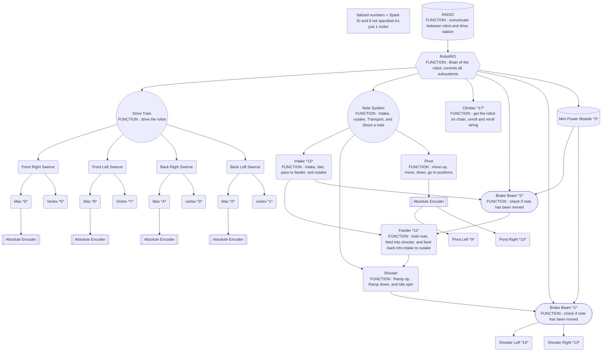

```mermaid
graph TD;
    A{{RoboRIO
FUNCTION : Brain of the robot, controls all subsystems}}-->2;
    2((Drive Train
FUNCTION : drive the robot ));
    A-->3((Note System
FUNCTION : Intake, outake, Transport, and Shoot a note));
    3-->B(Intake *15*
FUNCTION : intake, idel, pass to feeder, and outake);
    3-->c(Shooter
FUNCTION : Ramp up, Ramp down, and Idle spin);
    12-->s(Shooter Left *14*);
    12-->t(Shooter Right *13*);
    A-->d(Climber *17*
FUNCTION : get the robot on chain, unroll and reroll string);
    B-->e(Feeder *11*
FUNCTION : hold note, feed into shooter, and feed back into intake to outake)-->c;
    3-->f(Pivot
FUNCTION : move up, move, down, go to positions);
    9-->u(Pivot Left *9*)
    9-->v(Pivot Right *10*)
    2-->g(Front Right Swerve);
    2-->h(Front Left Swerve);
    2-->i(Back Right Swerve);
    2-->j(Back Left Swerve);
    g-->k(Max *6*);
    h-->l(Max *8*);
    i-->m(Max *4*);
    j-->n(Max *2*);
    g-->o(Vortex *5*);
    h-->p(Vortex *7*);
    i-->q(vortex *3*);
    j-->r(vortex *1*);
    k-->5[[Absolute Encoder]];
    l-->6[[Absolute Encoder]];
    m-->7[[Absolute Encoder]];
    n-->8[[Absolute Encoder]];
    f-->9[[Absolute Encoder]];
    15--->11
    A-->11
    B-->11([Brake Beam *2*
FUNCTION : check if note has been moved])-->e;
    A-->12
    c-->12([Brake Beam *1*
FUNCTION : check if note has been moved]);
    A-->15[(Mini Power Module *3*)]-->12;
    25[Italized numbers = Spark ID and if not specifeid it's just 1 motor];
    75[(RADIO
FUNCTION : comunicate between robot and drive station)]-->A;

```
